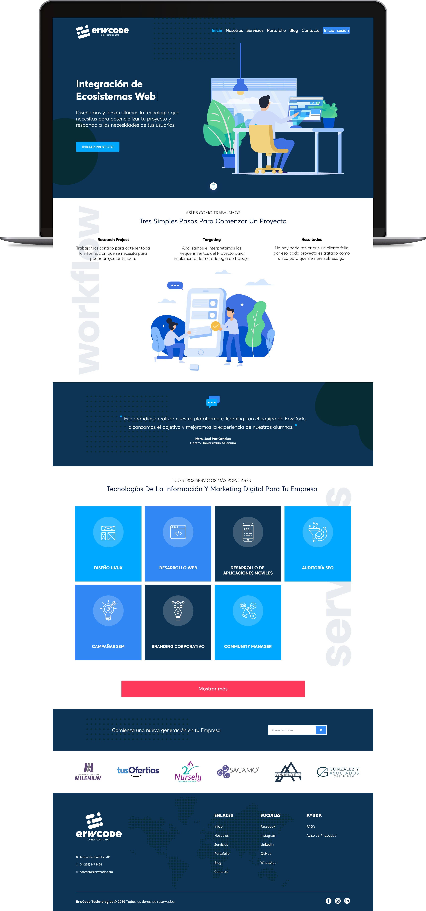

# ErwCode Technologies SPA

[![npm][npm]][npm-url]
[![node][node]][node-url]
[![GitHub contributors][contributors]][contributors-url]
![GitHub package.json version][version-url]

Este repositorio contiene el código Front-End & Back-End necesario para el desarrollo del sitio web [erwcode.com](https://erwcode.com).

> Flujo de trabajo utilizando Webpack 4, PUG, SCSS, SMACSS & ITCSS, BEM, PostCSS, Babel, Composer, PHP Slim, Medoo & MariaDB.

## Equipo de Desarrollo

Erwin Alan Frías Martínez | Front-End Developer & UI/UX Designer

* [LinkedIn](http://linkedin.com/in/erwinfriasmtz)
* [GitHub](https://github.com/erwinfriasmtz)

Marcos Felipe Frías Martínez | Full-Stack Developer & DBA

* [LinkedIn](http://linkedin.com/in/marcosfriasmtz)
* [GitHub](https://github.com/Marcos-Frias)

### Copyright ©

Made with 💖 by [ErwCode Technologies](https://erwcode.com/).

[npm]: https://img.shields.io/npm/v/webpack.svg
[npm-url]: https://npmjs.com/package/webpack

[node]: https://img.shields.io/node/v/webpack.svg
[node-url]: https://nodejs.org

[contributors]: https://img.shields.io/github/contributors/erwinfriasmtz/erwcode__website.svg?color=orange
[contributors-url]: https://github.com/erwinfriasmtz/erwcode__website/graphs/contributors

[version-url]: https://img.shields.io/github/package-json/v/erwinfriasmtz/erwcode__website.svg?color=red
